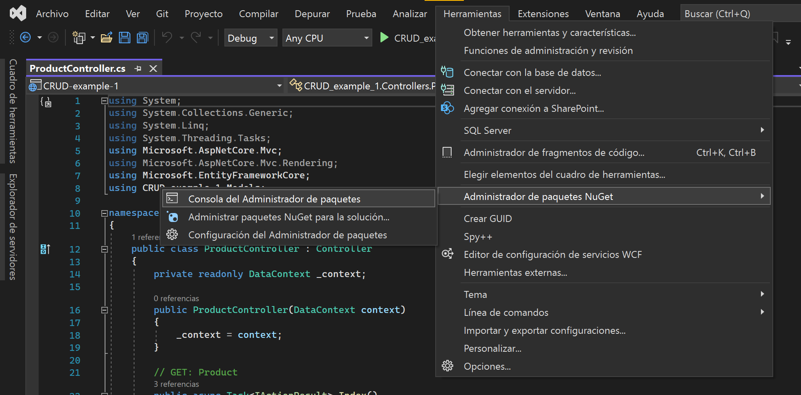
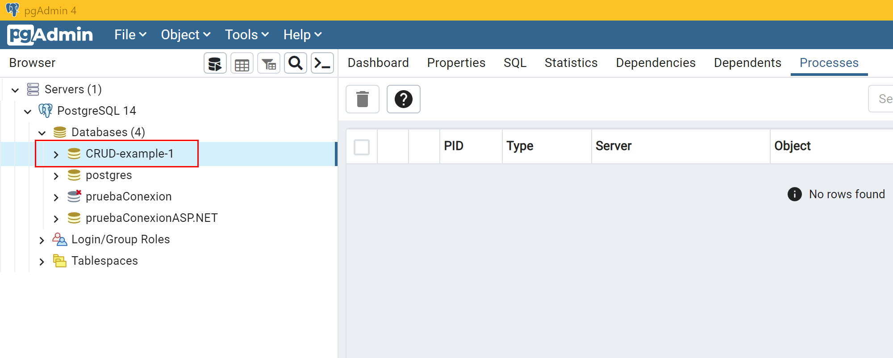

# CRUD ejemplo 1

<!-- TOC -->

- [1. Crear el proyecto](#crear-el-proyecto)
- [2. Crear el modelo del Producto](#crear-el-modelo-del-producto)
- [3. Creamos el modelo del DataContext](#creamos-el-modelo-del-datacontext)
- [4. Instalar el paquete de Ngpsql.EntityFrameworkCore.PostgreSQL](#instalar-el-paquete-de-ngpsqlentityframeworkcorepostgresql)
- [5. Crear un nuevo controlador para los productos](#crear-un-nuevo-controlador-para-los-productos)
- [6. Crear la BBDD a través de la *Consola de Administración de Paquetes*](#crear-la-bbdd-a-trav%C3%A9s-de-la-consola-de-administraci%C3%B3n-de-paquetes)
- [7. Añadimos el enrutamiento de la vista del CRUD de productos en el navbar](#a%C3%B1adimos-el-enrutamiento-de-la-vista-del-crud-de-productos-en-el-navbar)

<!-- /TOC -->

# 1. Crear el proyecto


# 2. Crear el modelo del Producto

Creamos una nueva clase llamada *ProductModel* dentro de la carpeta de *Models*:

```csharp
using System.ComponentModel.DataAnnotations;
using System.ComponentModel.DataAnnotations.Schema;

namespace CRUD_example_1.Models
{

    [Table("Product")]
    public class ProductModel
    {
        [Column("Id")]
        [Display(Name ="Id")]
        public int id { get; set; }

        [Column("Name")]
        [Display(Name = "Name")]
        public string name { get; set; }
    }
}
```

# 3. Creamos el modelo del DataContext

**Nota**: al definir la herencia de la clase *DbContext*, podemos darle a la ayuda de VS2022 (la lupa amarilla a la izquierda de la sentencia) para buscar e instalar en el acto el paquete *NuGet* correspondiente:


```csharp
using Microsoft.EntityFrameworkCore;

namespace CRUD_example_1.Models
{
    public class DataContext : DbContext
    {

        public DataContext(DbContextOptions<DataContext> options)
            : base(options)
        { }


        public DbSet<ProductModel> Products { get; set; }

    }
}
```

# 4. Instalar el paquete de Ngpsql.EntityFrameworkCore.PostgreSQL

Vamos al *Program.cs* para instalar el paquete de *Ngpsql.EntityFrameworkCore.PostgreSQL*:


y añadimos el siguiente servicio... el cual conecta con nuestra BBDD de PostgreSQL:

```csharp
builder.Services.AddEntityFrameworkNpgsql()
    .AddDbContext<DataContext>(options => options.UseNpgsql("Host=localhost;Port=5432;Pooling=true;Database=CRUD-example-1;UserId=postgres;Password=12345;"));
```

# 5. Crear un nuevo controlador para los productos


**Nota**: podemos observar que también se nos han creado las vistas de cada acción del CRUD:

# 6. Crear la BBDD a través de la *Consola de Administración de Paquetes*




Si ahora vamos a nuestro *pgAdmin* y refrescamos las bases de datos, encontramos la nueva que acabamos de crear automáticamente:




# 7. Añadimos el enrutamiento de la vista del CRUD de productos en el navbar


Y probamos las distintas funcionalidades del CRUD que VS2022 nos crea por defecto:


